# BuilderGate - Reputation-Gated Builder Vault

A Farcaster Mini App implementing a **Reputation-Gated Builder Vault (RGBV)** that rewards verified builders based on their GitHub contributions and identity verification using zkProofs and on-chain attestations.

## 🎯 Overview

BuilderGate combines DeFi yield distribution with developer reputation systems to create a fair funding mechanism for open-source contributors. The system uses:

- **Smart Contract (ReputationSplitter)** - On-chain reputation and reward distribution
- **zkProofs via Self Protocol** - Privacy-preserving identity verification (age 18+)
- **GitHub Proof Generation** - Verifiable contribution metrics and rank scoring
- **Talent Protocol** - Builder score and reputation validation
- **Farcaster Mini App** - Seamless social authentication

## 🏗️ System Architecture

### High-Level Architecture


### Component Architecture


### Data Flow Architecture

```mermaid
graph TD
    subgraph "User Interface"
        UI[React UI Components]
    end

    subgraph "State Management"
        FC[FarcasterContext<br/>User FID & Profile]
        SC[SelfContext<br/>Verification State]
        VS[Local State<br/>Verifications Object]
    end

    subgraph "API Layer"
        API1[/api/verify-self<br/>zkProof Verification]
        API2[/api/proof/github<br/>GitHub Rank]
        API3[/api/proof/talent<br/>Builder Score]
    end

    subgraph "External Services"
        SELF[Self Protocol<br/>Mobile App]
        GH[GitHub Stats API<br/>Contribution Data]
        TAL[Talent Protocol<br/>Reputation API]
    end

    subgraph "Blockchain"
        HOOK[useReputationSplitter<br/>Wagmi Hook]
        CONTRACT[ReputationSplitter.sol<br/>Ethereum Sepolia]
    end

    subgraph "Storage"
        CACHE[Verification Cache<br/>In-Memory Map]
        ONCHAIN[On-Chain Storage<br/>Developer Registry]
    end

    UI --> FC
    UI --> SC
    UI --> VS

    SC --> API1
    VS --> API2
    VS --> API3

    API1 --> SELF
    API2 --> GH
    API3 --> TAL

    API1 --> CACHE
    SC -.Poll Every 5s.-> API1

    UI --> HOOK
    HOOK --> CONTRACT

    CONTRACT --> ONCHAIN

    style UI fill:#f4ff00,stroke:#000,stroke-width:2px
    style CONTRACT fill:#4CAF50,stroke:#000,stroke-width:2px
    style SELF fill:#2196F3,stroke:#000,stroke-width:2px
    style ONCHAIN fill:#FF5722,stroke:#000,stroke-width:2px
```

## ✨ Current Features

### Core Functionality

1. **🔐 Multi-Wallet Support**
   - Farcaster Mini App Connector (auto-activates in Farcaster)
   - Injected wallets (MetaMask, Coinbase Wallet, etc.)
   - WalletConnect v2 (QR code & mobile wallets)

2. **🛡️ Three-Tier Verification System**
   - **Self Protocol**: zkProof verification for age 18+ (privacy-preserving)
   - **GitHub Proof**: Contribution ranking (S, A+, A, B, C, D ranks via github-readme-stats)
   - **Talent Protocol**: Builder score validation

3. **📊 Smart Contract Integration**
   - Registration phase tracking
   - On-chain proof submission (GitHub + Self Protocol)
   - Reward claiming with distribution rounds
   - Real-time phase detection (Registration → Active → Distribution)

4. **🎨 Modern UI**
   - Built with Next.js 15 + React 19
   - shadcn/ui components with Radix UI primitives
   - Tailwind CSS v4
   - Dark mode support
   - Responsive design

### Complete User Flow


## 🛠️ Tech Stack

### Frontend (Farcaster Mini App)

- **Next.js 15**: React framework with App Router
- **Wagmi v2**: React hooks for Ethereum (with Farcaster connector)
- **Viem**: TypeScript Ethereum library
- **@farcaster/miniapp-sdk**: Official Farcaster SDK
- **@selfxyz/core & @selfxyz/qrcode**: Self Protocol integration
- **WalletConnect v2**: Web3 wallet connection
- **Tailwind CSS v4**: Utility-first CSS framework
- **shadcn/ui**: Re-usable components (Radix UI)
- **lucide-react**: Icon system

### Smart Contracts

- **Solidity 0.8.x**: Smart contract language
- **ReputationSplitter.sol**: Main contract on Ethereum Sepolia
  - Address: `0x652cc79a37Ef6c9CD76179c6238A6C4CC3018493`
  - Chain ID: 11155111
  - Features: Registration, proof submission, reward claiming, phase management

### Backend APIs (Currently Active)

- **Verification APIs**:
  - `POST /api/verify-self` - Self Protocol zkProof verification
  - `POST /api/verify-self/check` - Poll verification status
  - `POST /api/verify-github` - GitHub verification handler
  - `POST /api/verify-talent` - Talent Protocol verification handler

- **Proof Generation APIs**:
  - `GET /api/proof/github?username=xxx` - GitHub contribution proof
  - `GET /api/proof/talent` - Talent Protocol score proof

- **OAuth APIs**:
  - `GET /api/auth/github/callback` - GitHub OAuth callback

### Network Support

- **Ethereum Sepolia Testnet** (Chain ID: 11155111) - Current deployment
  - Contract: `0x652cc79a37Ef6c9CD76179c6238A6C4CC3018493`
  - Faucet: [sepoliafaucet.com](https://sepoliafaucet.com/)
- **Future**: Ethereum Mainnet deployment

## 🚀 Getting Started

### Prerequisites

- Node.js 18+ and npm
- A WalletConnect Project ID ([Get one here](https://cloud.walletconnect.com/))
- Self Protocol scope (default: "buildergate")
- GitHub account for verification
- Wallet with Ethereum Sepolia testnet ETH ([Get from faucet](https://sepoliafaucet.com/))

### Installation

1. **Clone the repository:**

```bash
git clone https://github.com/yourusername/buildergate.git
cd BuilderGate
```

2. **Install dependencies:**

```bash
npm install
```

3. **Set up environment variables:**

```bash
cp .env.example .env.local
```

Edit `.env.local`:

```env
# Required: WalletConnect
NEXT_PUBLIC_WALLETCONNECT_PROJECT_ID=your_project_id_here

# Network Configuration (Ethereum Sepolia only)
NEXT_PUBLIC_CHAIN_ID=11155111

# App Configuration
NEXT_PUBLIC_SITE_NAME=BuilderGate
NEXT_PUBLIC_SITE_URL=http://localhost:3000

# Self Protocol Configuration
NEXT_PUBLIC_SELF_SCOPE=buildergate
NEXT_PUBLIC_SELF_APP_NAME=BuilderGate
NEXT_PUBLIC_SELF_USE_MOCK=false  # Set to true for testing without Self app
NEXT_PUBLIC_SELF_LOGO_URL=
NEXT_PUBLIC_SELF_DEEPLINK_CALLBACK=

# GitHub OAuth Configuration
NEXT_PUBLIC_GITHUB_CLIENT_ID=your_github_client_id
GITHUB_CLIENT_ID=your_github_client_id
GITHUB_CLIENT_SECRET=your_github_client_secret

# Talent Protocol API
TALENT_API_KEY=your_talent_api_key

# Contract Owner (for admin scripts)
OWNER_PRIVATE_KEY=your_owner_private_key_here
```

4. **Run the development server:**

```bash
npm run dev
```

Open [http://localhost:3000](http://localhost:3000) to see your app.

### Smart Contract Scripts

The project includes helper scripts for contract interaction:

```bash
# Start active phase (allows score setting)
npm run phase:start-active

# Set developer scores
npm run phase:set-scores

# Start new round with distribution
npm run phase:start-new-round
```

## 📁 Project Structure

```
BuilderGate/
├── app/
│   ├── layout.tsx              # Root layout with providers
│   ├── page.tsx                # Main landing page with verifications
│   ├── api/
│   │   ├── auth/
│   │   │   └── github/
│   │   │       └── callback/   # GitHub OAuth callback
│   │   ├── proof/
│   │   │   ├── github/         # GitHub proof generation
│   │   │   └── talent/         # Talent Protocol proof
│   │   ├── verify-self/        # Self Protocol verification
│   │   │   ├── route.ts        # Main zkProof handler
│   │   │   └── check/          # Polling endpoint
│   │   ├── verify-github/      # GitHub verification
│   │   └── verify-talent/      # Talent Protocol verification
│   └── globals.css
├── components/
│   ├── ui/                     # shadcn/ui components (Radix UI)
│   ├── ConnectButton.tsx       # Multi-wallet connection
│   ├── builder-score-card.tsx  # Reputation display
│   ├── verification-card.tsx   # Platform verification card
│   ├── verification-modal.tsx  # Generic verification flow
│   ├── self-verification-modal.tsx  # Self Protocol verification
│   ├── talent-verification-modal.tsx # Talent Protocol verification
│   ├── rewards-card.tsx        # Rewards claiming interface
│   └── theme-toggle.tsx        # Dark mode toggle
├── contexts/
│   ├── FarcasterContext.tsx    # Farcaster authentication
│   └── SelfContext.tsx         # Self Protocol state management
├── hooks/
│   ├── useReputationSplitter.ts # Contract interaction hook
│   └── usePlatformDetection.ts  # Farcaster detection
├── lib/
│   ├── wagmi.ts                # Wagmi configuration
│   ├── contracts.ts            # Contract addresses
│   └── abis/
│       └── ReputationSplitter.json  # Contract ABI
├── providers/
│   ├── wagmi-provider.tsx      # Wagmi + QueryClient
│   └── ThemeProvider.tsx       # next-themes integration
└── scripts/
    ├── change-phase.ts         # Phase management script
    └── set-scores.ts           # Developer score setting
```

## 🔐 Verification Systems

### Sequence Diagrams

#### Self Protocol Verification Flow


#### GitHub Proof Generation Flow

```mermaid
sequenceDiagram
    actor User
    participant UI as Frontend
    participant Modal as Verification Modal
    participant API as /api/proof/github
    participant GHStats as github-readme-stats.vercel.app
    participant Contract as ReputationSplitter

    User->>UI: Click "Verify GitHub"
    UI->>Modal: Open GitHub Modal
    Modal->>User: Request GitHub Username

    User->>Modal: Enter username
    Modal->>API: GET /api/proof/github?username=XXX

    API->>GHStats: Fetch stats SVG
    GHStats-->>API: Return SVG with rank

    API->>API: Extract rank from SVG
    Note over API: Parse "Rank: S/A/B/C/D"

    API->>API: Generate proof data
    Note over API: {platform, username, rank, verified, timestamp}

    API-->>Modal: Return proof data
    Modal->>UI: Update state (verified=true)
    Modal->>User: Show Success with Rank

    User->>UI: Complete all verifications
    UI->>Contract: register()
    Contract->>Contract: Store developer info
    Contract-->>UI: Transaction confirmed
    UI->>User: Registration Complete ✓
```



#### Reward Claiming Flow


### Self Protocol (zkProof Verification)

**Purpose**: Privacy-preserving age verification (18+)

**Flow**:
1. User clicks "Verify with Self Protocol"
2. Modal displays three options:
   - **Open Self App** - Deeplink to mobile app
   - **Show QR Code** - Scan with Self app
   - **Copy Link** - Share universal link
3. User completes verification in Self mobile app
4. Self app sends zkProof to `/api/verify-self`
5. Backend validates proof and stores result
6. Frontend polls `/api/verify-self/check` every 5 seconds
7. Verification complete - user sees success state

**Privacy**: Proves age 18+ without revealing exact date of birth

**Technical**:
- Uses `@selfxyz/core` for backend verification
- Uses `@selfxyz/qrcode` for QR code generation
- Supports mock passport mode for testing (`NEXT_PUBLIC_SELF_USE_MOCK=true`)

### GitHub Proof Generation

**Purpose**: Verify GitHub contributions and assign rank

**Flow**:
1. User enters GitHub username
2. System fetches stats from `github-readme-stats.vercel.app`
3. Extracts rank from SVG response (S, A+, A, B, C, D)
4. Generates proof data with timestamp

**Ranking System**:
- **S**: Elite contributor (top tier)
- **A+/A**: Very active contributor
- **B**: Active contributor
- **C**: Moderate contributor
- **D**: New or inactive contributor

### Talent Protocol

**Purpose**: Builder score validation (optional)

**Flow**:
1. Requires GitHub verification first
2. Validates Talent Protocol builder score
3. Optional third verification tier

## 📊 Smart Contract Interface

### Contract State Machine


### Reward Distribution Algorithm


### ReputationSplitter.sol

**Deployed on Ethereum Sepolia**: `0x652cc79a37Ef6c9CD76179c6238A6C4CC3018493`
**Chain ID**: 11155111

**Key Functions**:

```solidity
// Read Functions
function currentPhase() external view returns (uint8)
function currentRound() external view returns (uint256)
function getUnclaimedRounds(address dev) external view returns (uint256[])
function getRegisteredDevs() external view returns (address[])
function getDevInfo(address dev) external view returns (bool[4])
function roundRewardPool(uint256 round) external view returns (uint256)
function roundDevScores(uint256 round, address dev) external view returns (uint256)

// Write Functions
function register() external  // Register for current round
function claim() external      // Claim rewards for unclaimed rounds

// Admin Functions (contract owner only)
function startActivePhase() external
function setDevScores(address[] devs, uint256[] scores) external
function startNewRound() external payable
```

**Phases**:
- **0 - Registration**: Developers register and submit proofs
- **1 - Active**: Admin sets scores based on proofs
- **2 - Distribution**: Developers can claim rewards

### Contract Hook (useReputationSplitter)

```typescript
const {
  // Contract info
  contractAddress,
  currentPhase,
  currentRound,
  phaseName,

  // User data
  unclaimedRounds,
  hasUnclaimedRewards,
  isAlreadyRegistered,
  hasAlreadyClaimed,

  // Actions
  handleRegister,
  handleClaim,

  // Status
  isRegisterPending,
  isClaimPending,
  isRegisterSuccess,
  isClaimSuccess,
} = useReputationSplitter()
```

## 🎨 UI Components

### Custom Components

- **ConnectButton**: Multi-wallet connection with provider priority
- **BuilderScoreCard**: Displays builder score after all verifications
- **VerificationCard**: Generic platform verification card
- **SelfVerificationModal**: Self Protocol verification with QR/deeplink
- **TalentVerificationModal**: Talent Protocol verification flow
- **RewardsCard**: Registration and reward claiming interface
- **ThemeToggle**: Dark/light mode switcher

### shadcn/ui Components

All UI primitives from shadcn/ui (built on Radix UI):
- Dialog, Modal, Popover
- Button, Input, Label
- Card, Badge, Avatar
- Tabs, Accordion, Collapsible
- Toast, Alert Dialog
- Progress, Slider
- And more...

## 🗺️ Roadmap

### Phase 1: MVP ✅ (Current)
- [x] Farcaster Mini App setup
- [x] Multi-wallet integration
- [x] Self Protocol zkProof verification
- [x] GitHub proof generation
- [x] Talent Protocol integration
- [x] Smart contract deployment (Ethereum Sepolia)
- [x] Registration and claiming UI
- [x] Dark mode support

### Phase 2: Enhancement 🚧 (In Progress)
- [ ] Enhanced GitHub OAuth flow
- [ ] Full Talent Protocol API integration
- [ ] Enhanced proof validation
- [ ] Real-time contract event listening
- [ ] Notification system for phase changes
- [ ] Improved error handling

### Phase 3: Production 📋 (Planned)
- [ ] Ethereum Mainnet deployment
- [ ] Uniswap v4 hook integration (future yield source)
- [ ] ERC-4626 vault for yield distribution
- [ ] Advanced reputation scoring algorithm
- [ ] DAO governance for parameters
- [ ] Subgraph for historical data

### Phase 4: Advanced Features 🔮 (Future)
- [ ] Reputation token (ERC-20)
- [ ] NFT badges for achievements
- [ ] Leaderboard and analytics
- [ ] Multi-round history dashboard
- [ ] Mobile app (React Native)

## 🔒 Security Considerations

### Current Security Measures

1. **zkProof Verification**: Self Protocol ensures privacy-preserving age verification
2. **On-Chain Proof Storage**: Immutable verification records
3. **Phase-Based Access Control**: Registration, Active, Distribution phases
4. **Admin Controls**: Only contract owner can set scores and change phases
5. **Reentrancy Protection**: Built into Solidity contract patterns

### Known Limitations

- GitHub proof relies on external API (github-readme-stats.vercel.app)
- Currently deployed on Ethereum Sepolia testnet only
- No MEV protection on claim transactions yet
- Single contract owner (should upgrade to multi-sig for mainnet)
- Verification cache stored in-memory (resets on server restart)

## 🤝 Contributing

Contributions are welcome! Please follow these steps:

1. Fork the repository
2. Create a feature branch (`git checkout -b feature/amazing-feature`)
3. Commit your changes (`git commit -m 'Add amazing feature'`)
4. Push to the branch (`git push origin feature/amazing-feature`)
5. Open a Pull Request

### Development Guidelines

- Follow existing code style (TypeScript strict mode)
- Use shadcn/ui components for consistency
- Test wallet connections thoroughly
- Document new API endpoints
- Update README for significant changes

## 📝 License

MIT License - see [LICENSE](LICENSE) file for details

## 🙏 Acknowledgments

- [Farcaster](https://www.farcaster.xyz/) for the Mini App SDK
- [Self Protocol](https://www.self.xyz/) for zkProof infrastructure
- [Wagmi](https://wagmi.sh/) for excellent React hooks
- [shadcn/ui](https://ui.shadcn.com/) for beautiful components
- [Next.js](https://nextjs.org/) for the React framework
- [Talent Protocol](https://www.talentprotocol.com/) for builder reputation

## 📞 Support

For questions and support:
- Open an issue on GitHub
- Join our [Farcaster channel](https://warpcast.com/~/channel/buildergate)
- Email: support@buildergate.xyz

## 🔗 Links

- **Live Demo**: [buildergate.vercel.app](https://buildergate.vercel.app)
- **Contract Explorer**: [Sepolia Etherscan](https://sepolia.etherscan.io/address/0x652cc79a37Ef6c9CD76179c6238A6C4CC3018493)
- **Sepolia Faucet**: [sepoliafaucet.com](https://sepoliafaucet.com/)
- **Documentation**: Coming soon
- **Twitter**: [@BuilderGate](https://twitter.com/buildergate)

---

**Built with ❤️ for the builder community**

*Empowering developers through verifiable reputation and fair rewards.*
